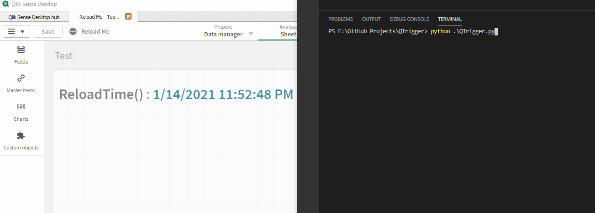

# QTrigger

## About
Python Script to Interact with QIX and trigger app reload using Web Socket and Qlik Engine API.



## How to Setup

* Add Applcation IDs in ReloadList.json
```json
{
    "Apps" :  [
        {
            "AppId" : "<AppID>"
        }
    ]
    
}
```
* Update reload list file location
```python
reloadListPath = './ReloadList.json'
```
* Add param in create_connection if using header AUTH.
```python
 create_connection(url, sslopt = sslopt)
```

* Run QTrigger file.
